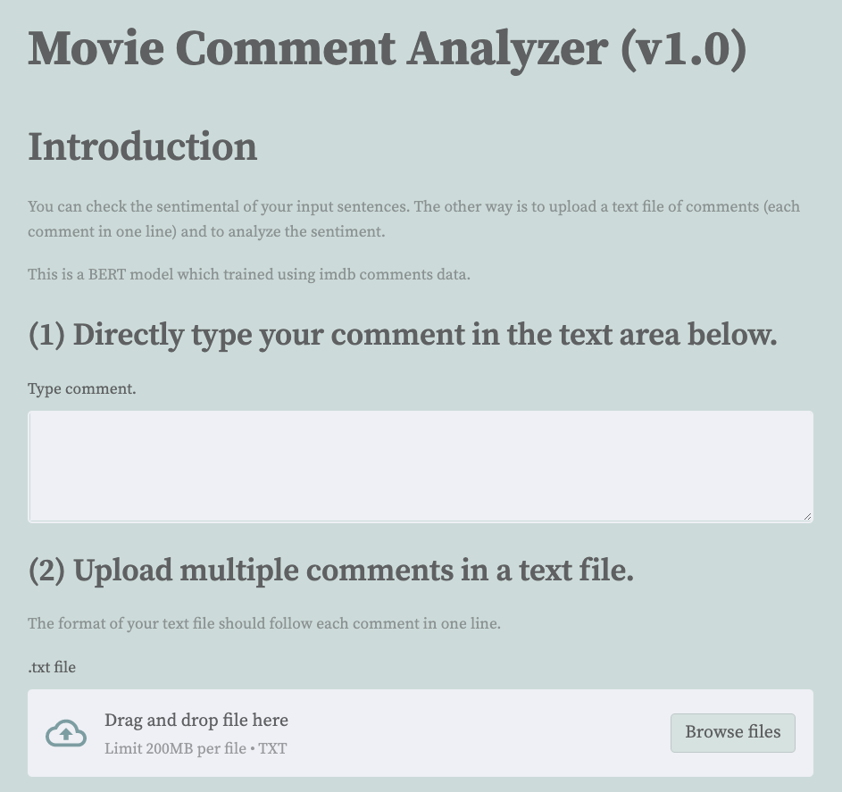

# nlp_streamlit  
A project to develop an easy website for the sentimental check using NLP model,  
BERT (Bidirectional Encoder Representations from Transformers).  

You can type comments in the first area space and it will calculate a percentage score of how the comments are like. You can also upload a text files with each comment in a row and it will visualize the distribution of the score of comments and also calculate an average score.

